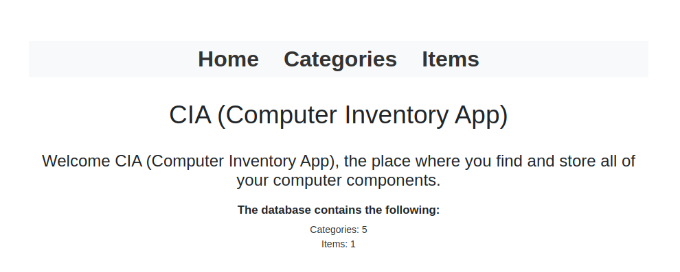
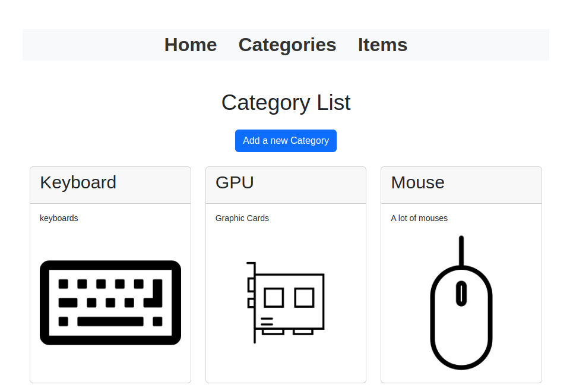
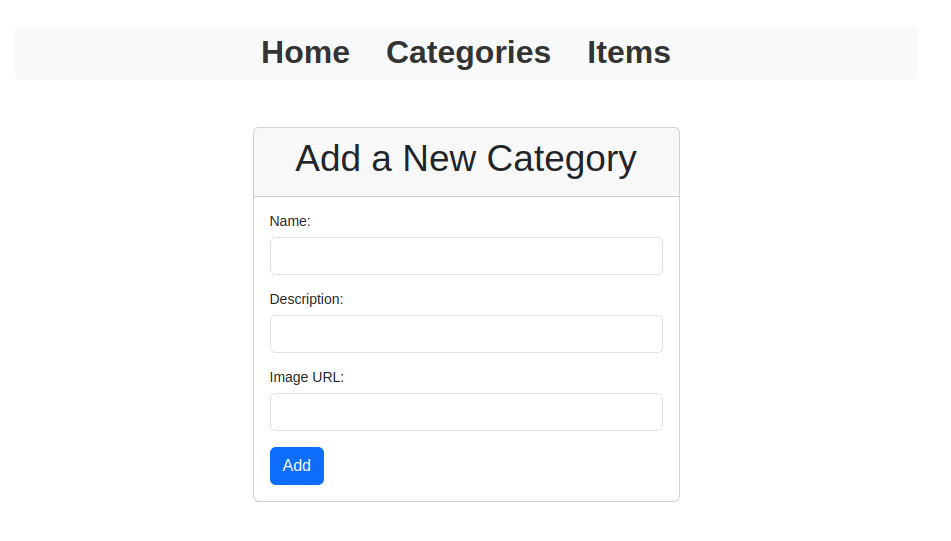
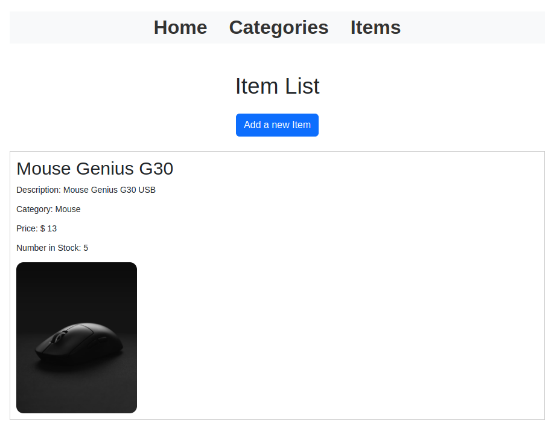
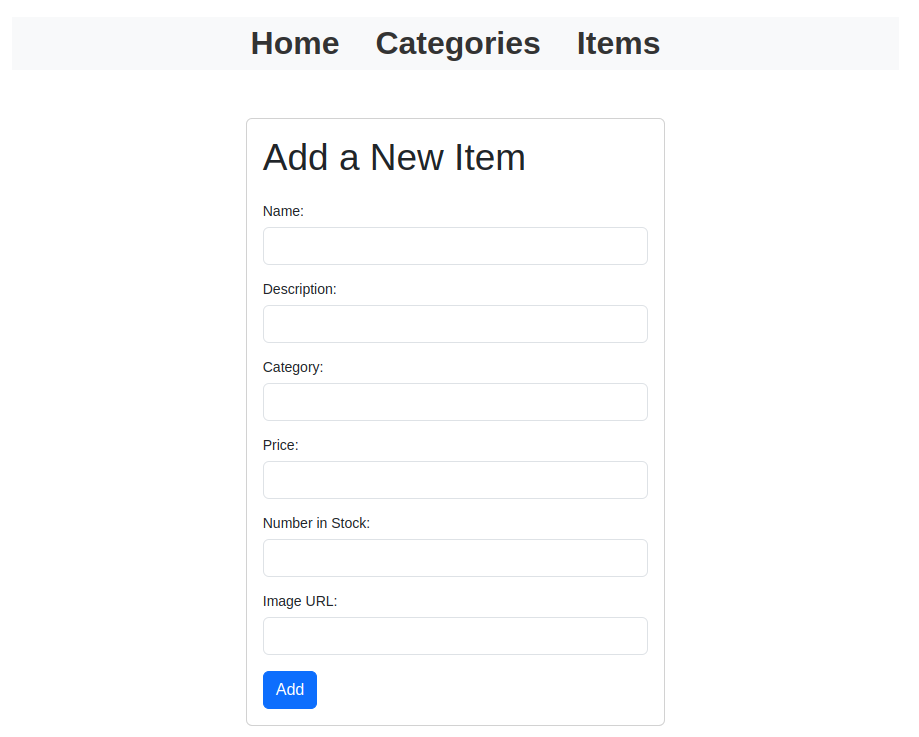

# Inventory App

## This is an inventory app for an imaginary computer shop as a challenge in the NodeJS section for The Odin Project curriculum.

### This project was built with:

* NodeJS
* ExpressJS
* MongoDB Atlas
* Mongoose
* Bootstrap CSS and a bit of vanilla CSS
* Pug

#### This is the home page where you can see the number of categories and items that are stored in the database:

#### When you click "Categories" you can see the all the categories that are stored in the DB.

#### You can add a new category by click the button "Add a new Category", fill in the fields with a name, a description and an image url to represent the category, and finally click Add to add the new category.

#### Then you can visit the Items secction and see the items that are stored in the DB. Also if you want to add a new item, you can click the blue button "Add a new Item" and it would show you a form (similar like we did with "Categories").

#### And here is the form to add a new item. Fill in the data (all of them are strings), and finally click "Add" and you will see the new item.

### You can visit the live app [here](https://inventory-tonybaldev.koyeb.app/)

### TODO:

* Improve CSS.
* "View Products" button in the card of the category to see all the products of that specific category.
* Admin Dashboard, to update and delete categories and items.
* Other features..
